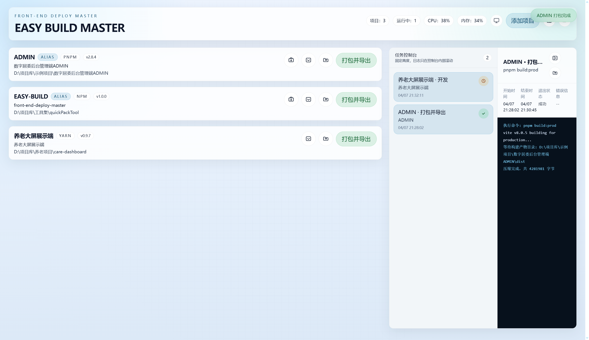
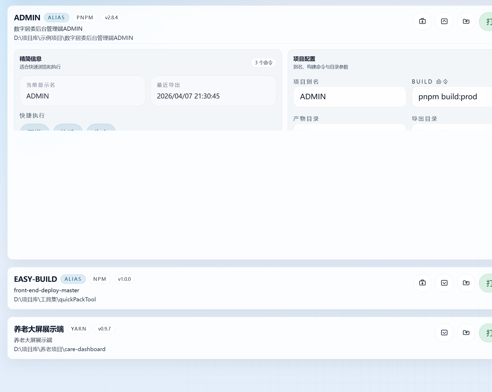
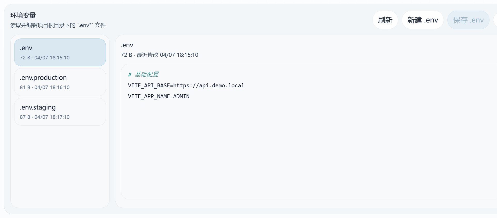
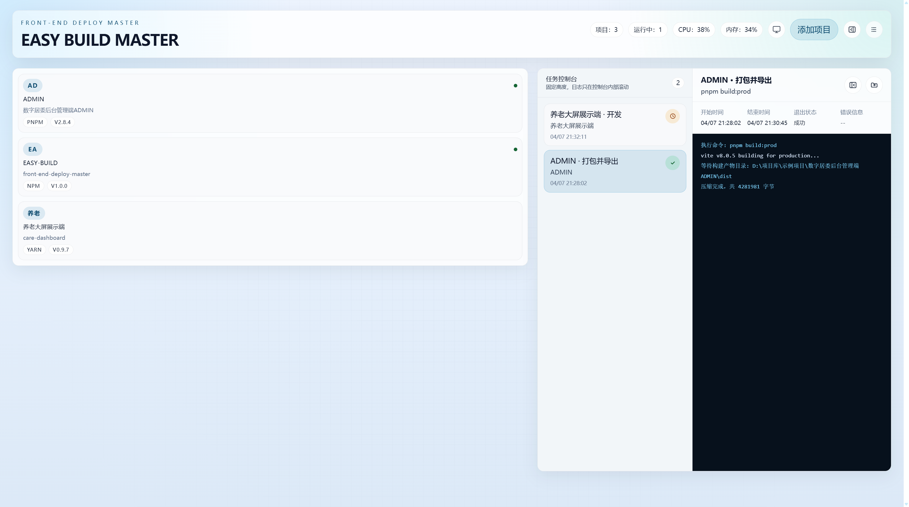

# Front-End Deploy Master

Windows 桌面端前端项目管理与发布工具。  
用于统一管理本地前端项目、执行快捷命令、编辑 `.env` 文件，并将构建产物一键压缩为 zip 发布包。



> 当前文档中的界面截图由内置模拟项目数据生成，便于稳定展示主要功能和交互布局。

## 核心能力

- 添加本地前端项目目录，自动读取 `package.json` 中的 `name`、`version`、`scripts`
- 支持项目别名、Build 命令、产物目录、导出目录配置
- 快捷指令支持手动输入，也支持从 `package.json scripts` 导入
- 应用内实时查看任务日志，并可停止运行中的命令
- 一键构建并导出发布 zip
- 默认导出目录为 `dist-releases`
- 压缩包命名格式：`项目别名或项目名_YYYY年MM月DD日_HH时mm分ss秒.zip`
- 支持读取与编辑项目根目录下的 `.env` / `.env.*` 文件
- 支持项目拖动排序、浅色 / 深色主题、顶部 CPU / 内存状态展示

## 界面预览

### 项目详情与快捷指令



### 环境变量编辑器



### 缩略项目栏



## 适用场景

- 同时维护多个前端项目，需要统一入口管理
- 经常执行 `dev`、`build`、`preview`、`test` 等命令
- 需要重复导出 `dist` 构建产物并打包为发布 zip
- 需要在发版前快速调整 `.env` 文件

## 技术栈

- Electron
- React
- Vite
- TypeScript
- Tailwind CSS
- `archiver`

## 开发环境要求

- Windows 10 / 11
- Node.js 18+
- 项目本身所需包管理器：`pnpm` / `npm` / `yarn`

## 本地调试运行

```bash
npm install
npm run dev
```

说明：

- 会同时启动 Vite 与 Electron
- 修改前端界面文件通常可热更新
- 修改 `electron/main.cjs`、`electron/preload.cjs` 后需要完整重启开发进程

## 生产构建

```bash
npm run build
npm run dist:win
```

默认安装包输出目录：

```text
release-build/Front-End Deploy Master Setup 1.0.0.exe
```

## 文档导航

- [项目介绍](./docs/项目介绍.md)
- [使用教程](./docs/使用教程.md)

## 常用命令

```bash
npm run check
npm run build
npm run docs:screenshots
npm run dist:win
```

其中：

- `npm run check`：TypeScript 类型检查
- `npm run build`：构建前端产物
- `npm run docs:screenshots`：重新生成文档截图
- `npm run dist:win`：构建 Windows 安装包

## 数据存储

项目配置会保存在 Electron `userData` 目录下的 `projects.json` 中，通常包括：

- 项目路径
- 项目别名
- 构建配置
- 快捷指令
- 最近导出产物路径
- 项目排序结果

## 目录说明

```text
docs/               图文文档与截图
docs/images/        README / 教程截图
electron/           Electron 主进程与 preload
scripts/            文档截图生成脚本
shared/             前后端共享类型
src/                React 前端界面
release-build/      Windows 安装包输出目录
```

## 常见说明

### 为什么修改主进程代码后需要重启？

因为 Electron 主进程和 `preload` 不会像 Vite 前端那样自动热替换，修改后需要重新执行 `npm run dev`。

### 为什么默认导出目录是 `dist-releases`？

如果压缩源目录是 `dist`，同时又把导出目录设置到 `dist` 内部，压缩输入与输出会发生重叠，容易造成压缩过程异常或卡住。  
默认使用 `dist-releases` 可以稳定避免这个问题。
